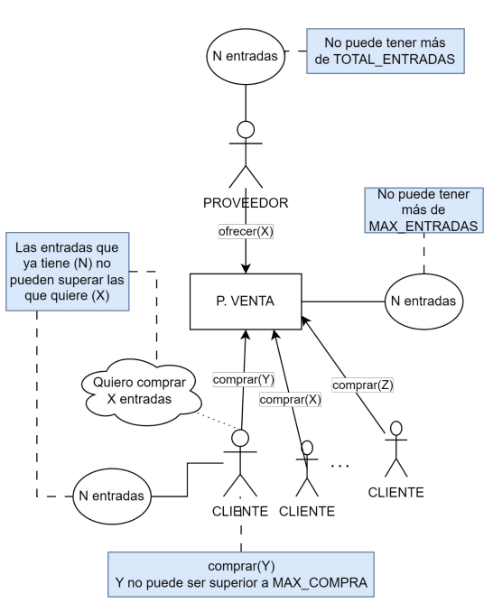
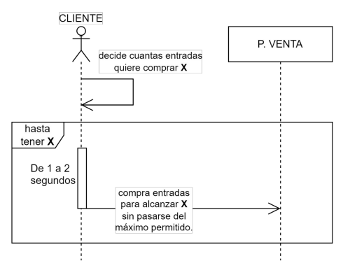

# Examen Programación de Servicios y Procesos 2023/2024
Se pretende simular el funcionamiento de un punto de venta de entradas para un festival de música. El
punto de venta recibe entradas de un proveedor y se las vende a los clientes. Deben cumplirse las
siguientes especificaciones:

### Punto de venta
* Es el lugar donde los clientes hacen cola para comprar sus entradas.
* Tiene una capacidad limitada de entradas disponibles `MAX_ENTRADAS (~10)` que nunca puede ser superada.
* Para evitar la reventa de entradas, el punto de venta solo venderá como máximo `MAX_COMPRA (~2)` entradas a cada cliente en cada compra. Esto quiere decir que un mismo cliente puede volver en otro momento y comprar más entradas.
* Cada vez que el proveedor incrementa el número de entradas en X cantidad, se mostrará por pantalla: porveedor-repone-X
* Cada vez que un cliente compre X entradas se mostrará por pantalla: `cliente_N-compra-X` (siendo N el número de cliente).

### Proveedor
* En el momento inicial es quien tiene todas las entradas `TOTAL_ENTRADAS (~100)` y se
encarga de abastecer al punto de venta.
* El proveedor le ofrecerá entradas al punto de venta entre 1 y 5 veces cada segundo (en lapsos de
tiempo aleatorios entre 0.2s y 1.0s).
* La cantidad máxima de entradas que ofrece es la capacidad de almacenamiento del punto de
venta (`MAX_ENTRADAS`). En caso que el proveedor disponga de menos entradas, le ofrecerá todas
las entradas disponibles.
* En cuanto el proveedor se quede sin entradas, avisará al punto de venta y finalizará su ejecución.
* Si el punto de venta se queda sin clientes dispuestos a comprar entradas, el proveedor mostrará
por pantalla `Proveedor-sobran-X` (siendo X el número de entradas que le quedan) y
finalizará su ejecución.

### Cliente
* Hay un total de `MAX_CLIENTES (~20)` independientes identificados por un número.
* Lo primero que hace un cliente es decidir cuantas entradas quiere comprar (entre 1 y
`NUM_ENTRADAS (~10)`). En este momento se mostrará por pantalla: `cliente_N-quiere-X`
(N: número de cliente; X: entradas que quiere comprar).
* Los clientes tardan entre 1 y 2 segundos en ir al punto de venta a realizar cada compra. Un cliente
irá tantas veces al punto de venta como sea necesario para comprar todas las entradas que quiere.
* Si cuando el cliente se dispone a comprar las entradas, el punto de venta no tiene suficientes, este
esperará a que llegue el proveedor con más entradas. Evidentemente, mientras un cliente espera
otros clientes pueden intentar comprar entradas. En caso que el proveedor no vaya a volver el
cliente comprará todas las entradas que pueda.
* El cliente terminará su ejecución cuando haya conseguido todas las entradas que quiere comprar
o cuando no queden entradas en el punto de venta (ni vayan a llegar entradas nuevas).

Al finalizar el programa se mostrará por pantalla cuantas entradas sobran en el punto de venta: `Puntov-sobran-x`

## Esquema de funcionamiento

## Ejemplo de salida
    Cliente_10-quiere-2
    Cliente_6-quiere-9
    Cliente_7-quiere-8
    Cliente_0-quiere-2
    Cliente_5-quiere-7
    …
    Cliente_18-quiere-1
    Cliente_17-quiere-3
    Proveedor-repone-10
    Cliente_15-compra-2
    Proveedor-repone-2
    Cliente_11-compra-2
    Cliente_6-compra-2
    Cliente_10-compra-2
    Cliente_19-compra-2
    Cliente_2-compra-2
    Proveedor-repone-10
    Cliente_7-compra-2
    Cliente_18-compra-1
    Cliente_5-compra-2
    Cliente_14-compra-2
    Cliente_9-compra-2
    Cliente_8-compra-1
    Proveedor-repone-10
    …
    Proveedor-repone-6
    Cliente_6-compra-2
    Cliente_5-compra-1
    Cliente_19-compra-1
    Proveedor-repone-4
    Cliente_4-compra-1
    Proveedor-repone-1
    Cliente_6-compra-1
    Proveedor-sobran-3
    Puntov-sobran-9
    FIN-PROGRAMA